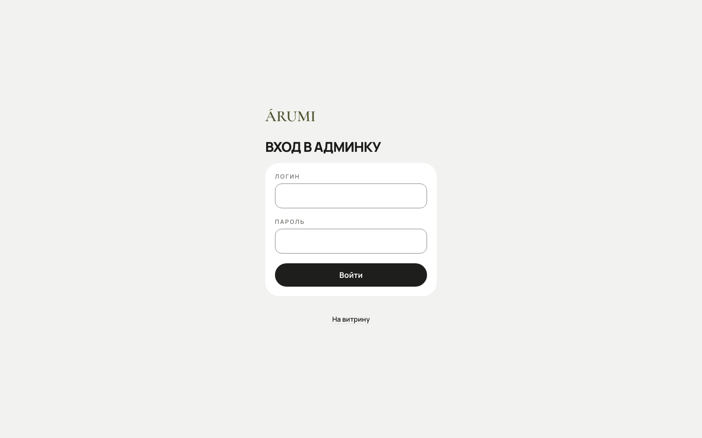
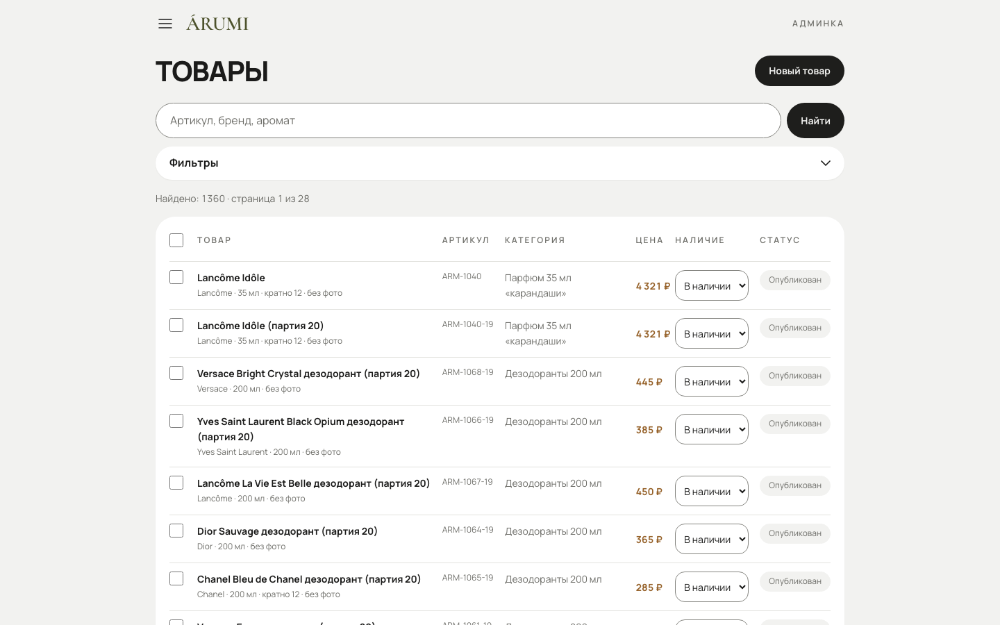
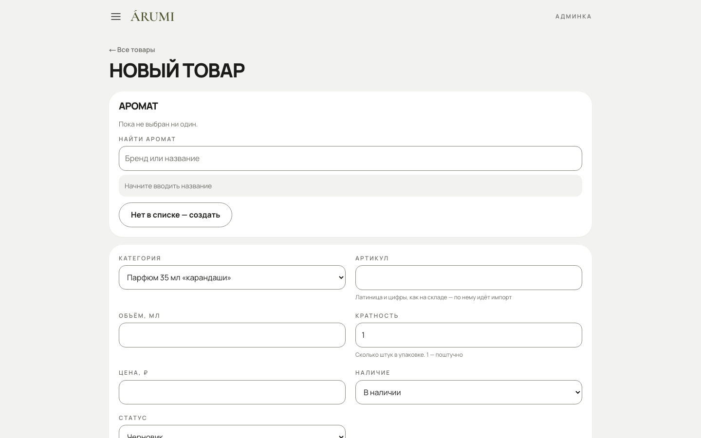
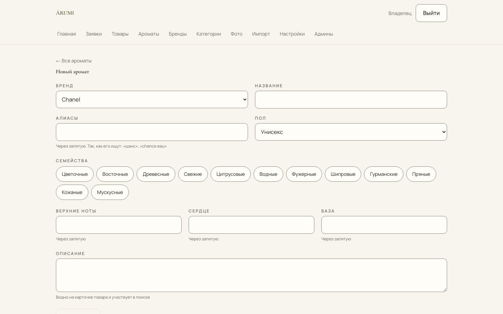
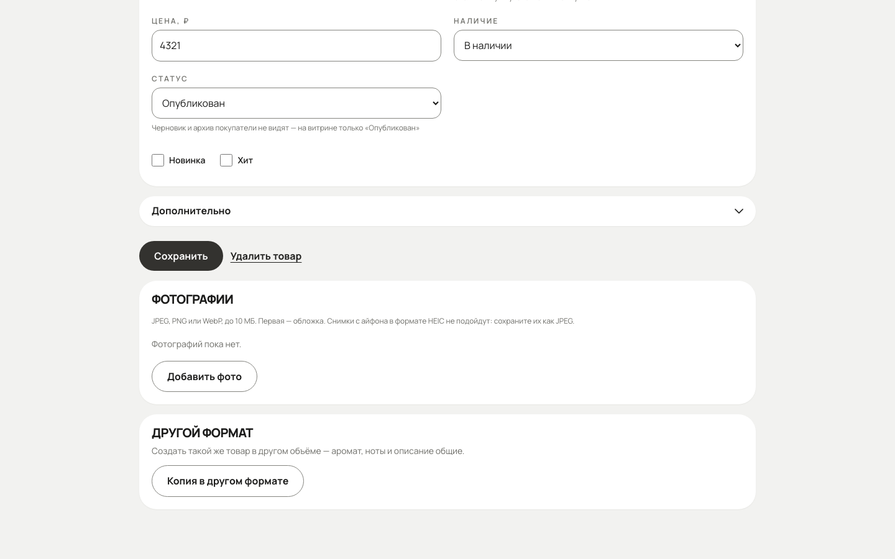
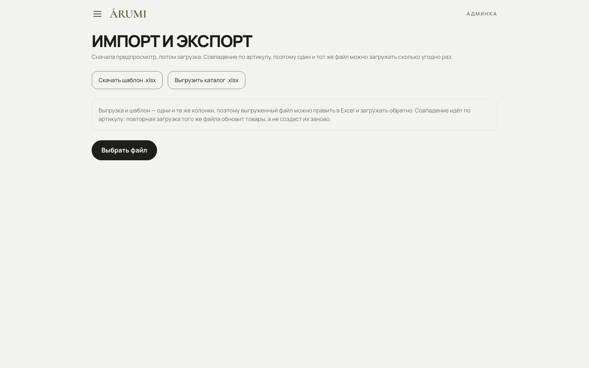
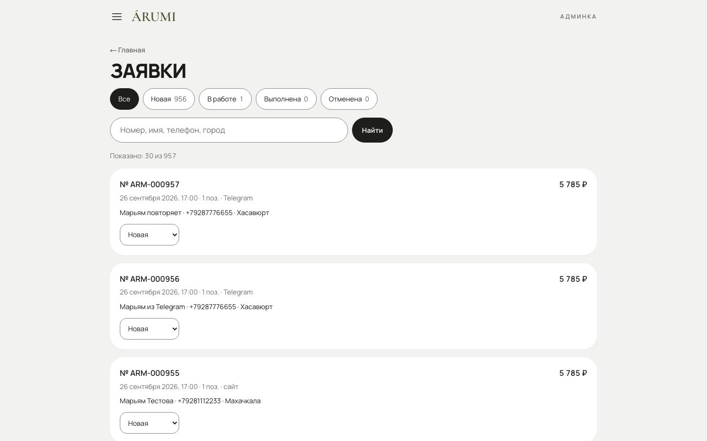
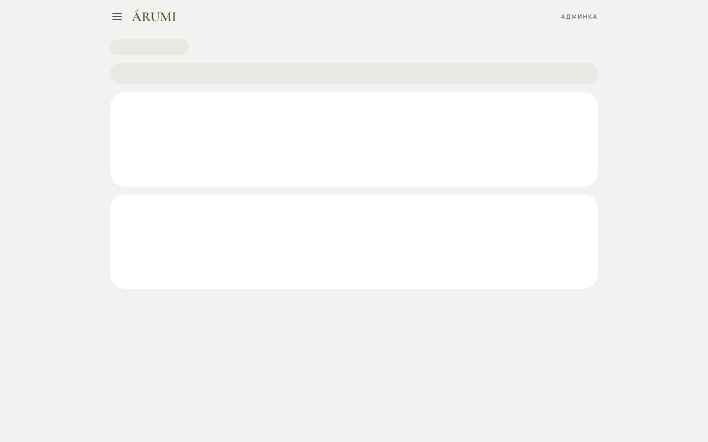
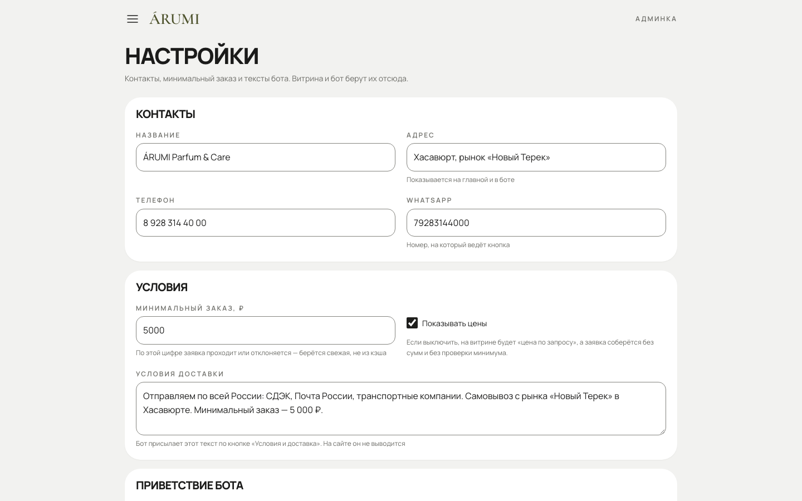

# Как работать с каталогом

Для того, кто ведёт каталог ÁRUMI. Никаких технических слов — только что нажать
и что получится.

Админка живёт по адресу
**[web-production-f03bf.up.railway.app/admin](https://web-production-f03bf.up.railway.app/admin)**.
Сохраните его в закладки. Открывается и с компьютера, и с телефона: на телефоне
всё то же самое, только в один столбец.

Адрес длинный, потому что своего домена у каталога пока нет. Его можно
подключить позже — тогда адрес станет короче, а этот документ я обновлю.

Все разделы — в меню (три полоски слева вверху): **Главная**, **Товары**,
**Категории**, **Настройки**, **Админы**. Там же кнопка **Новый товар** и
**Выйти**.

---

## Содержание

1. [Как войти](#как-войти)
2. [С чего начать](#с-чего-начать)
3. [Устройство каталога: бренд → аромат → товар](#устройство-каталога)
4. [Добавить товар](#добавить-товар)
5. [Добавить фотографии](#добавить-фотографии)
6. [Тот же аромат в другом объёме](#тот-же-аромат-в-другом-объёме)
7. [Загрузить прайс из Excel](#загрузить-прайс-из-excel)
8. [Заявки](#заявки)
9. [Контакты, минимальный заказ, текст бота](#настройки)
10. [Админы: добавить менеджера](#админы)
11. [Что делать, если](#что-делать-если)

---

## Как войти

**С телефона, из Telegram** — отправьте нашему боту `/start` или `/admin`. Под
сообщением появится кнопка **«Админ-панель»** — её видят только
администраторы. Нажмите её, введите логин и пароль и нажмите **«Войти»**.

**С компьютера** — откройте `web-production-f03bf.up.railway.app/admin`,
введите логин и пароль и нажмите **«Войти»**.

Кодов из Telegram не нужно — только логин и пароль. Их выдаёт владелец. После
входа панель помнит вас 12 часов, потом попросит войти снова.

Пароль — единственное, что защищает цены, товары и телефоны покупателей. Не
пересылайте его в переписке и не храните на видном месте.

---

## С чего начать

Сейчас каталог пустой, и на витрине написано «Каталог наполняется». Начинайте
по порядку:

1. **Категории → «Новая категория».** Впишите название — например «35 мл»,
   «100 мл», «Двойняшки», «Дезодоранты». Подзаголовок можно не заполнять: это
   строка под названием на главной. Оставьте галочку «Показывать на витрине» и
   нажмите «Сохранить». Форма останется открытой — тут же можно нажать
   «Загрузить фото» и добавить картинку категории. **Без категории товар не
   сохранить:** каждый товар лежит в какой-то из них.
2. **Товары → «Новый товар»** — как описано [ниже](#добавить-товар). Новый
   товар сохраняется **черновиком**: покупатели его не видят. Чтобы он появился
   на витрине, в поле «Статус» выберите «Опубликован» и нажмите «Сохранить».
3. Если товаров много — **Товары → «Загрузить из Excel»**
   ([подробнее](#загрузить-прайс-из-excel)). Категории из колонки «Категория»
   заведутся сами.

**Категория появляется на витрине вместе с первым опубликованным товаром в
ней.** Пустую покупатель не увидит — так он не попадёт на пустую страницу. В
разделе «Категории» под каждой написано, сколько в ней товаров и сколько из них
на витрине. Пока опубликованных нет, там так и сказано: «на витрине появится с
первым опубликованным товаром». Это не ошибка.

---

## Устройство каталога

Три уровня, и порядок имеет значение:

**Бренд** → **Аромат** → **Товар**

- **Бренд** — Chanel, Dior. Заводится один раз.
- **Аромат** — «Coco Mademoiselle». У аромата есть описание, ноты, пол,
  семейство. Один аромат — одна карточка описания, сколько бы объёмов вы ни
  продавали.
- **Товар** — то, что покупают: «Coco Mademoiselle, 100 мл, 1 250 ₽, кратно 6».
  У товара есть цена, объём, артикул, наличие.

Смысл в том, что описание аромата пишется **один раз**, а покупатель видит его
на карточке каждого объёма. И на странице товара сам собой появляется список
«этот аромат в других форматах».

«Двойняшки» — товар, у которого **два** аромата. Так и заводится: один товар,
два аромата в списке.

---

## Добавить товар

**Товары → Новый товар.**

Заполняется сверху вниз:

| Поле          | Что писать                                                                                                           |
| ------------- | -------------------------------------------------------------------------------------------------------------------- |
| **Аромат**    | Начните печатать — найдётся. Нет в списке — кнопка «Нет в списке — создать» тут же рядом                             |
| **Категория** | Выберите из списка. Список пустой — сначала создайте категорию в разделе «Категории»                                 |
| **Артикул**   | Ваш код, латинскими буквами и цифрами, без пробелов. По нему сверяется загрузка из Excel — он должен быть уникальным |
| **Объём, мл** | Число                                                                                                                |
| **Кратность** | По сколько штук продаёте. 1 — поштучно                                                                               |
| **Цена, ₽**   | Можно «1250», «1 250», «1250,50» — поймёт                                                                            |
| **Наличие**   | В наличии / мало / нет / под заказ                                                                                   |
| **Статус**    | **Черновик** — виден только вам. **Опубликован** — виден покупателям. Новый товар — черновик                         |

Название и адрес страницы можно не заполнять: соберутся из бренда и аромата.
Они спрятаны под «Дополнительно», там же старая цена.

Нажмите «Сохранить». Со статусом «Опубликован» товар сразу на витрине. Со
статусом «Черновик» он сохранён, но покупатели его не видят — на **Главной**
такие товары собраны в строке «Черновики», чтобы не потерялись.

### Аромата ещё нет

Нажмите «Нет в списке — создать» прямо в форме товара и впишите бренд и
название. Если такого бренда ещё нет, он заведётся сам — отдельно создавать
его не нужно.

Описание и ноты — по ссылке **«Ноты»** рядом с выбранным ароматом. Их можно
дописать и позже.

Здесь пишется то, что покупатель читает на странице: описание, верхние ноты,
сердце, база. Ноты вводятся по одной, через запятую или с новой строки.

Эти три строки складываются на витрине в пирамиду — так, как принято в
парфюмерии. Пустые не показываются, поэтому заполнять все три необязательно.

---

## Добавить фотографии

На странице товара — раздел **Фотографии**, кнопка **Добавить фото**. Раздел
появляется после первого сохранения товара. Можно выбрать сразу несколько
фотографий.

- Снимайте телефоном как есть — поворот, обрезка и сжатие делаются сами.
- **Первая фотография — обложка.** Порядок меняется стрелками.
- Если одна из нескольких не загрузилась, остальные всё равно загрузятся, и
  будет видно, какая именно не прошла.

**С айфона:** в настройках камеры выберите «Наиболее совместимый». Иначе
телефон снимает в формате HEIC, который не подойдёт — каталог скажет об этом
прямо и предложит сохранить как JPEG.

Пока фотографии нет, товар показывается с фирменной монограммой. Это
нормальный вид, а не ошибка — каталогом можно пользоваться.

**Много фотографий сразу:** страница
**web-production-f03bf.up.railway.app/admin/photos**. Назовите файлы
артикулами — каждая фотография сама найдёт свой товар, заходить в каждый не
нужно.

---

## Тот же аромат в другом объёме

Не заводите товар заново. На странице товара внизу — **«Копия в другом
формате»**.

Спросит новый артикул, объём, цену и кратность. Аромат, описание и ноты —
общие, потому что это тот же аромат.

---

## Загрузить прайс из Excel

**Товары → «Загрузить из Excel»** (ссылка под списком товаров). Кнопка
**Выбрать файл**, дальше `.xlsx` или `.csv`.

Как это работает:

1. Файл **сначала показывается**, а не загружается. Вы видите, сколько строк
   готово и какие с ошибками — с номером строки и тем, что в ней не так.
2. Строки с ошибками пропускаются, остальные загружаются.
3. **Сверка идёт по артикулу.** Повторная загрузка того же файла обновит
   товары, а не создаст их заново. Можно грузить исправленный прайс сколько
   угодно раз.

Колонки подбираются по названиям — «цена», «Цена, руб», «price» понимаются
одинаково. Если ваш заголовок не узнали, он будет в списке «колонки, которые мы
не знаем и пропустим».

Категории, которых ещё нет, заводятся из колонки «Категория» сами.

**Выгрузить каталог .xlsx** — кнопка на той же странице. Выгруженный файл можно
править в Excel и загружать обратно: колонки те же.

Новые товары из импорта приходят **черновиками** — если в файле нет колонки
«Статус» со словом «Опубликован». Опубликовать черновики можно разом: в списке
товаров отметить галочками и выбрать массовое действие.

---

## Заявки

Новая заявка приходит сообщением в Telegram — с составом, суммой, телефоном и
кнопкой **«Открыть в админке»**. Приходит в тот чат, который владелец настроил
для заявок: личный или общий с менеджерами.

В меню раздела заявок нет, но потерять заявку нельзя:

- пока есть новые, на **Главной** в блоке «Доделать» видна строка **«Новые
  заявки»** с их числом — нажмите, и откроется список;
- весь список с поиском и фильтром по статусу — по адресу
  **web-production-f03bf.up.railway.app/admin/orders**. Добавьте его в
  закладки.

Если сообщение в Telegram почему-то не пришло, заявка всё равно сохранена — она
в этом списке.

Внутри — что заказали, на какую сумму, как связаться и какая доставка. Статус
меняется одной кнопкой:

**Новая** → **В работе** → **Выполнена** (или **Отменена**)

Взяли заявку — переведите её в «В работе», и она уйдёт из «Новых заявок» на
Главной.

Покупатель видит статус у себя в «Моих заявках».

Суммы в заявке зафиксированы на момент оформления. Если вы потом поменяли цену,
в старой заявке останется та, по которой договаривались.

---

## Настройки

**Настройки** — всё, что меняется без программиста:

- **Название, адрес, телефон, WhatsApp** — показываются на главной, в подвале и
  в боте.
- **Минимальный заказ** — по этой цифре заявка проходит или отклоняется.
  Подняли до 7 000 ₽ — следующая заявка считается уже по новой.
- **Показывать цены** — выключатель. Выключите, и вместо цен покупатель увидит
  «цена по запросу», а заявка соберётся без сумм.
- **Условия доставки** — текст, который покупатель получает в боте, когда
  нажимает кнопку «Условия и доставка». Название, адрес, телефон и минимальный
  заказ бот сам поставит над ним. На сайте этот текст не показывается.
- **Приветствие бота** — первое, что человек видит после `/start`. **Баннер
  приветствия** — картинка над ним.

**Приветствие бота и условия доставки — ваш собственный текст, целиком.** Если
в нём написаны адрес, WhatsApp или минимальный заказ, сами они не обновятся:
поменяли в полях выше — поправьте и в тексте.

Сейчас в приветствии и в условиях написано, что заказ оформляется в WhatsApp.
При этом покупатель может оставить заявку прямо в каталоге, и она придёт вам в
Telegram. Если хотите, чтобы заказывали через каталог, поправьте эти два
текста.

Раздел виден только владельцу. У редактора его нет.

---

## Админы

### Кто может что

|                                          | Владелец | Редактор |
| ---------------------------------------- | -------- | -------- |
| Товары, ароматы, бренды, категории, фото | да       | да       |
| Заявки и статусы                         | да       | да       |
| Импорт и выгрузка                        | да       | да       |
| Настройки                                | да       | **нет**  |
| Список администраторов                   | да       | **нет**  |

### Добавить менеджера

Сначала узнайте его Telegram ID. Это число, а не имя пользователя. Пусть
человек отправит нашему боту `/id` — бот ответит «Ваш Telegram ID: …». Нажмите
на число, оно скопируется; пусть перешлёт его вам.

Дальше **Админы → «Добавить администратора»** и поля:

- **Имя** — как человек будет называться в списке.
- **Логин** — латинскими буквами, от 3 знаков, например `manager`.
- **Telegram ID** — то самое число.
- **Роль** — «Редактор» работает с товарами и заявками, «Владелец» может всё,
  включая настройки и список админов.
- **Пароль** — длинный и случайный, от 16 знаков. Каталог примет и 10, но
  короткий пароль легче подобрать.

Нажмите «Сохранить». Передайте человеку логин, пароль и адрес админки — лично
или голосом, не в переписке. Потом пусть отправит нашему боту `/start`: под
приветствием появится кнопка «Админ-панель».

**Человек больше не работает** — нажмите «Отключить». Доступ пропадёт сразу,
удалять ничего не нужно.

**Забыл пароль** — «Править» у этого человека → «Новый пароль» → «Сохранить».

---

## Что делать, если

**Товар не виден на витрине.** Проверьте статус — скорее всего «Черновик».

**Категории нет на витрине.** В ней ещё нет ни одного опубликованного товара,
или снята галочка «Показывать на витрине».

**Категория не удаляется.** В ней есть товары. Каталог скажет, сколько именно:
перенесите их в другую категорию или удалите.

**Аромат не удаляется.** Его используют товары. Сначала товары.

**Покупатель говорит, что цена другая.** Если он собрал заявку вчера, а вы
подняли цену сегодня, при отправке он увидит экран «было → стало» с разницей и
подтвердит новую цену. Ничего не сломалось — так и задумано.

**Не пускает в админку.** Если пишет «Неверный логин или пароль», проверьте
раскладку и Caps Lock: пароль различает большие и маленькие буквы. Если с
компьютера пускает, а из Telegram нет, или в боте нет кнопки «Админ-панель» —
значит, в разделе «Админы» у вас записан не тот Telegram ID. Узнайте свой через
`/id` у бота и попросите владельца его исправить. Если пишет «Слишком много
попыток входа», подождите десять минут. Если пишет «Вход временно
недоступен», подождите минуту и попробуйте снова; не проходит и через
несколько минут — напишите мне.

**Заявки перестали приходить в Telegram.** Сами заявки не теряются: они на
Главной в строке «Новые заявки» и по адресу
web-production-f03bf.up.railway.app/admin/orders. Сообщите мне — значит,
сбилась настройка чата для заявок.

**Фотография легла боком.** Не должна — поворот делается автоматически по
метке камеры. Если всё же легла, пришлите её мне: значит, телефон записал метку
непривычным образом.

**Забыли пароль.** Новый может выдать владелец в разделе «Админы». Если забыл
владелец — напишите мне.
